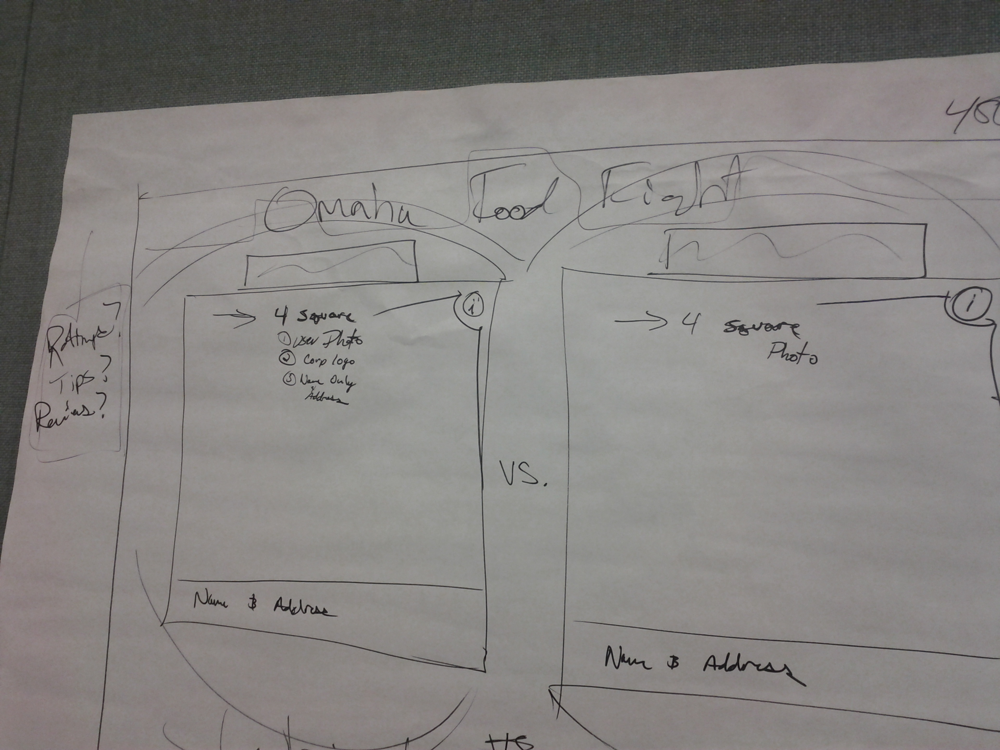
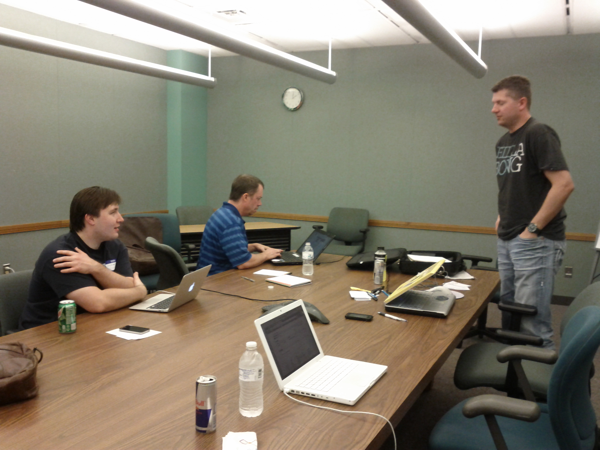
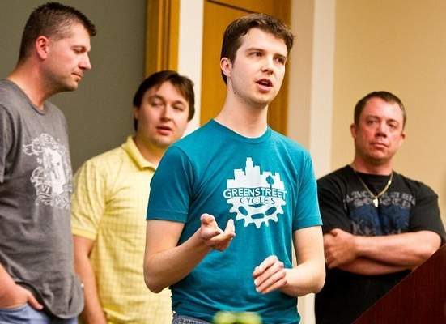

This weekend I took part in Hack Omaha - the city's first hackathon with a focus on making apps from public data. We built an app that <a href="http://www.omahafoodfight.org/">gameified health inspection data</a>. It was awesome. Nate's already written up an <a href="http://fullycroisened.com/omaha-food-fight-hackomaha-app/">hour by hour recap</a> of our team's experience, but I thought I'd share specifics of what I learned.

<ul>
	<li><strong>Pitch an idea, even if it's not a winner.</strong> Nick Wertzburger started the pitch session off with a joke app (I think) that he <a href="https://twitter.com/#!/rannick/status/187954462441218048">tweeted earlier</a>. It was one of only a handful of pitches, and his team ran with it and melded it into an awesome <a href="http://www.safeomaha.org/">heatmap </a>page; my favorite project of the weekend.</li>
	<li><strong>Sinatra rocks</strong>. My day job consists of writing Web Services, with a capital W and S. The process is often heavyweight, cumbersome, and requires numerous approval and manual configuration steps. It was beyond refreshing to just write a <code>get /matchup</code> method, paste in some JSON, and have a working service. Prototyping service design before you've even gotten a dataset gives you lots of flexibility to change your design on the fly.</li>
</ul>

<ul>
	<li><strong>Heroku is great, except when it isn't</strong>. We ran the app's service layer on a shared (read: free) Heroku instance and a shared Postgres database. This was my first experience hosting apps on Heroku, so I relied on Steve's expertise. Pushing changes was simple as pie, but we ran into numerous issues getting Rake migrations to function correctly. We ended up creating databases on my machine, and using Heroku's backup/restore feature to load up production. It's not pretty but it got the job done.</li>
	<li><strong>Designers are worth their weight in gold</strong>. With all due respect to Nate's work, we could have used someone to help with the usability, icon design and overall polish of our app. Most projects were in the same boat. But they were in extremely limited supply here.</li>
	<li><strong>ORM flexibility is helpful</strong>. Since you have no idea what tech stack you'll be working with, you don't want to require teammates to have a particular database already installed. For example, Steve didn't have Postgres installed on his MacBook, but we just configured a SQLite instance on his box, set up his ActiveRecord configuration to connect to it and he was off and running.</li>
</ul>

<ul>
	<li><strong>Don't let your VCS hold you back.</strong> We decided to use <a href="https://github.com/organizations/HackOmahaFoodInspectors/">GitHub</a> to host the source, but only half the team had any git experience. Rather than try to learn a crash-course on git, they used a shared Dropbox folder as the repository location.</li>
	<li><strong>Colocation isn't necessary</strong>. We spent most of Saturday working from our individual houses, and we stood up a Google+ Hangout to help. The video chat and screensharing worked really smoothly. We probably had an advantage over the folks who worked at the hackathon venue, as wi-fi was spotty the whole weekend.</li>
	<li><strong>We could have been more ambitious with our tech stack.</strong> We were familiar with almost every piece of what we built. Then I look at <a href="http://www.omahabountyhunter.com/">Omaha Bounty Hunter</a>, which was developed against a <strong><a href="http://www.meteor.com/">five-day old JavaScript framework</a></strong>, and I feel a little sad that we didn't try something farther out there. At the very least, we could have tried a document database like Mongo, given that nothing we were doing was relational.</li>
	<li><strong>Keep projects small and focused</strong>. We were essentially finished with our app by 6pm on Saturday. After that, we spent the rest of the time play testing, tweaking the design, and adding features like analytics, win/loss counting, etc. But having a small, achievable project meant we weren't scrambling to get basic functionality working at the last minute.</li>
</ul>

  <ul>
  	<li><strong>I don't know Ruby very well</strong>. I kept running into syntax issues, like trying to return early out of a block (which isn't allowed). I also spent a ton of time learning the methods on Enumerable, and figuring out how attributes in ActiveRecord models function. You only have to look at the number of <code>Hash.new</code> and <code>Array.new</code> in the codebase to see that we're still noobs at this.</li>
  	<li><strong>Untested code becomes legacy code, fast</strong>. We cranked out the services with nary a unit test in sight. If it didn't cause a syntax error, we shipped it. By the end, all code was making into Sinatra routes, which meant we had to reload our web app each time we wanted to change a `group_by`, or see if our ActiveRecord query was right. This slowed us down noticeably, even by day 3 of the project.</li>
  	<li><strong>Not all prepwork is fruitful</strong>. I tried to learn two new technologies before the hackathon: <a href="http://neo4j.org/">Neo4J</a> and <a href="http://www.postgis.org/">PostGIS</a>. I thought each might be helpful, and I spent weeks trying to learn just enough to fake knowing it for a weekend. But I ended up using neither. Rather, a 2-hour session with <a href="http://twitter.github.com/bootstrap/">Twitter Bootstrap</a> proved far more useful than anything else I knew.</li>
  </ul>
  Much thanks to <a href="https://twitter.com/#!/steven_a_s">Steve</a>, <a href="https://twitter.com/#!/fullycroisened">Nate</a> and <a href="https://twitter.com/#!/mikeask">Mike</a> for putting up with me this weekend. And many, many thanks to <a href="https://twitter.com/mattwynn">Matt</a> for setting up the event. I'm ready to do it again.
