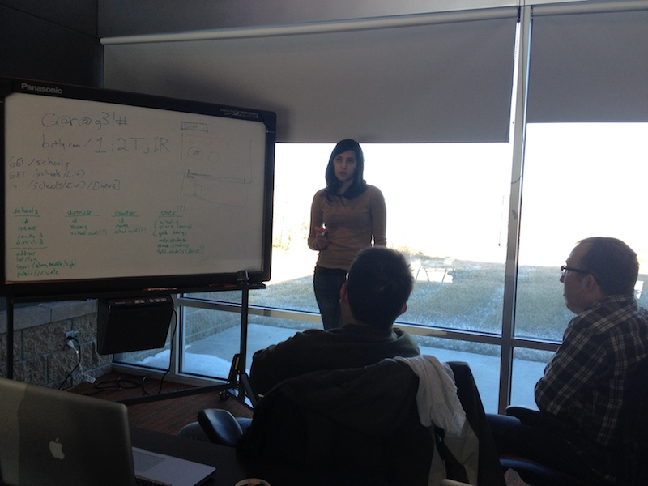
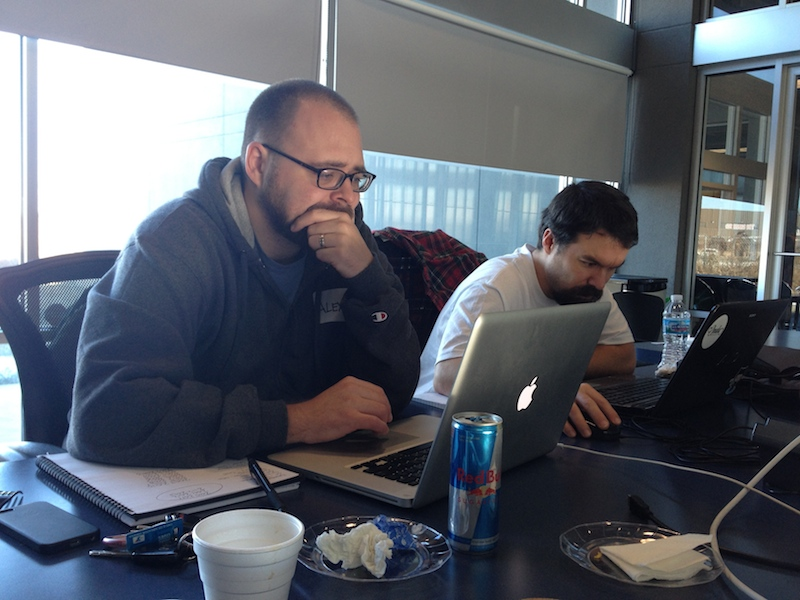

A few weeks ago I took part in the third [Hack Omaha](https://twitter.com/hackomaha), a civic hackathon put on by [Matt Wynn](https://twitter.com/mattwynn), [Open Nebraska](https://web.archive.org/web/20140413035547/http://opennebraska.io:80/), and others.

We built a website to [visualize Omaha Public School's enrollment data][schools]. It was a blast to build, and not just because it helped answer burning questions of teammate, parent, and all-around cool guy [Alex Gates](http://www.ketv.com/news/local-news/parents-worry-about-overpacked-classrooms-kids-education/-/9674510/21457722/-/trv6dnz/-/index.html?absolute=true&utm_source=dlvr.it&utm_medium=twitter&utm_campaign=ketv).
Alex wanted to know why his daughter's kindergarden class had 39 children in it when classes began.

Here's what I learned.

## Going Nuts

This was all [Jerod Santo][1]'s fault.

At the first Hack Omaha, Jerod amazed me by building his project in a [days-old JavaScript framework][meteor].
It was a high-wire act, but he convinced me that [I should follow suit][2].

So when Hack Omaha rolled around this year, Jerod and I decided to team up and try a language neither of us knew. His suggestion: [Go][go] - Google's new(ish) language. Juan Vazquez joined in, and [a team based on ignorance was born][3].

Go's [docs][godocs] describe the language:

> Go compiles quickly to machine code yet has the convenience of garbage collection and the power of run-time reflection. It's a fast, statically typed, compiled language that feels like a dynamically typed, interpreted language.



## Going to School

I spent some time learning the language, and the [Go tour](https://tour.golang.org/) was my main source.
Perhaps it's the Ken Thompson-inspired origins, but it was nice working with a language that didn't condescend to you and treat you as a programming neophyte.
I often feel like this about other guide, such as \_why's Poigniant Guide to Ruby.

## A Vodka Martini, Chilled

At this point, we had an idea that an app would be Go serving up an API on the backend, and a web frontend running AngularJS.
The Changelog also had a really helpful post outlining Go's [web application ecosystem][goweb].

Go has an impressive standard library and can serve HTTP easily out of the box, but we decided to apply a framework to provide a little structure.
We went with [Martini][martini]; a Sinatra-esque library that is less than a month old, in a proud Hack Omaha tradition.

Our services ended up with this structure.

```go
m.Get("/schools", func(res http.ResponseWriter) string {
  return render(res, allSchools)
})
```

This should look similar to Sinatra and its bretheren.
Martini gives you the objects you need (like a ResponseWriter) via parameterized Dependency Injection, which is super convenient.

JSON encoding, HTTP headers, enabling CORS, all worked out of the box.

I've heard it's also testable, but nary a unit test was written during the hackathon.
I should have known better, based on my [lessons from last time][hackomaha1].
That said, Go has [testing built into the language](http://golang.org/doc/code.html#Testing), so it'll be there when we're ready.



## Databases, GORM Style

Go has database operations built into the standard library; just bring your own database-specific adapter.
We went with MySQL, which [has a great Go adapter](https://github.com/go-sql-driver/mysql).
And writing queries is lame, so we tried out an ORM called [Gorm][gorm].
This was a little more mature, as it was a full 6 weeks old.

Using Gorm is pretty simple: define a `struct` with types named like your database columns:

```go
type School struct {
Id int64
Name string `sql:"size:255"`
CountyId int64
DistrictId int64
Lat float64
Lon float64
}
```

And populate them:

```go
var school = School{}
schoolId := params["id"]
db.Where("id = ?", schoolId).First(&school)
```

ORMs are appealing, especially when your database tables are denormalized by design to allow simple querying.
But the additional complexity Gorm brought might not have been worth it.
ORMs are known as the [Vietnam of Computer Science](https://web.archive.org/web/20131031003739/http://blogs.tedneward.com/2006/06/26/The+Vietnam+Of+Computer+Science.aspx) for a reason.

Throughout Friday and all of Saturday, we were unable to connect to the database using Gorm's classes.
It wasn't until nearly midnight on Saturday that we were able to figure out the correct incantations to get MySQL and Gorm [to pull in data](https://github.com/mattdsteele/hackomaha-ops/commit/fe841c50d8b9a0116bd8e94545730e75df46bd00#diff-34c6b408d72845d076d47126c29948d1R18).

Clearer documentation might have helped, but in the end it turned out to be mostly user error.

Error handling in Go is idiomatically performed by returning two values from a function: the result you were expecting and an `err` parameter.
If the `err` value is null, things went great. Otherwise, you have an error that needs handling.
As we were connnecting to databases in Gorm, we weren't retrieving that second parameter; so we never knew we had a badly formed database URI, even though the library was begging to tell us.

Lesson: understand the idioms of a language you're futzing around with.


## Go Fly a Kite

It wasn't all sunshine. Beyond database and library issues, here's a few problems I encountered with Go:

- I like functional collections, and using slices (Go's version of an array) in a functional manner proved impossible.
  Go _appears_ to have functions for `filter`, `map`, and others, but we never got them working.
  It appears that Go programmers are content to use `for` loops for everything, which is what we ended up doing.
- Go provides strict checks at compile time. This includes failing the build when you have declared a variable or import that you haven't used.
  Normally I love these checks, but this proved more annoying than useful in the iterative environment of a hackathon.
- As a user of third-party libraries, Go's package management is great (simply type `go get github.com/package` and it's available).
  But I never figured how to split apart our single-file Go program into a decent structure.
  We settled on placing our `struct`s in one file, and everything else in another.
  They all shared the `main` package, as well.

## So you won, right?

Nope. [This project did.](https://web.archive.org/web/20160826210702/http://douglas.ne.localboards.org:80/)

## So we should blame Go?

Nah. The Boards team had a better product, and changing our backend wouldn't have made the difference.

If anything, I'm ready to double down on Go for the next hackathon.

You get productivity out of the box with a great standard library, plus the performance of a natively-compiled app, plus a syntax that feels both classical and modern.

So forget the [LAMP](https://en.wikipedia.org/wiki/LAMP_(software_bundle\)) or [MEAN](http://mean.io/) stacks.
Try building your next application on [GAP: Go, AngularJS, and Postgres](https://twitter.com/jerodsanto/status/405744094510473216).

### [View the final code on GitHub](https://github.com/mattdsteele/hackomaha-ops)

`vine:hUKDzMbhOBx`

[schools]: http://schools.opennebraska.io/
[1]: https://twitter.com/jerodsanto/
[meteor]: http://blog.jerodsanto.net/2012/04/confessions-of-a-meteor-newb/
[2]: http://blog.jerodsanto.net/2012/04/confessions-of-a-meteor-newb/#comment-507865511
[go]: http://golang.org/
[3]: https://twitter.com/jerodsanto/status/394909959948754944
[godocs]: http://golang.org/doc/
[goweb]: http://thechangelog.com/on-go-web-application-ecosystem
[martini]: http://martini.codegangsta.io/
[hackomaha1]: /lessons-learned-from-the-first-hack-omaha/
[gorm]: https://github.com/jinzhu/gorm
