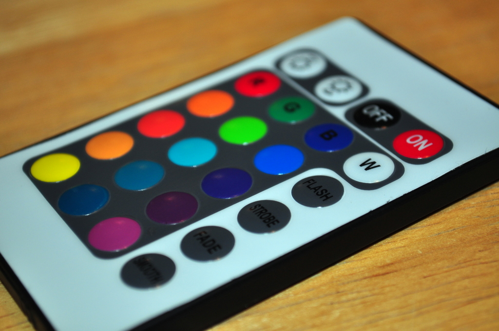
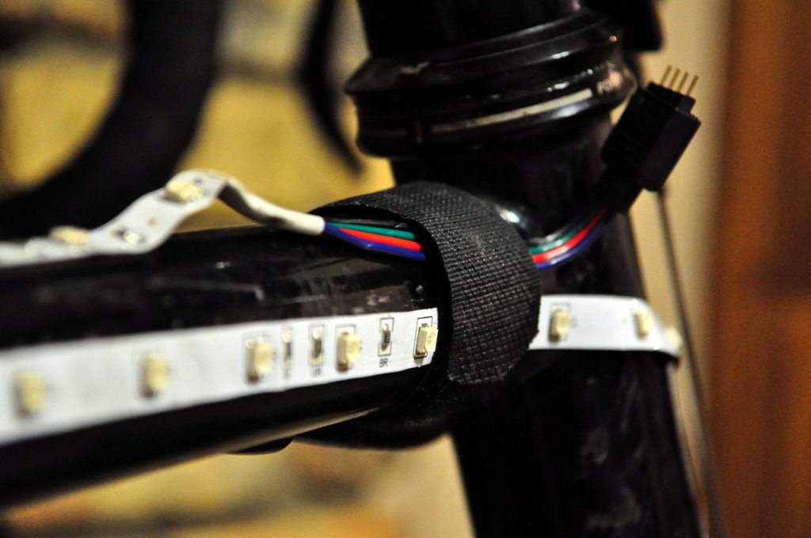
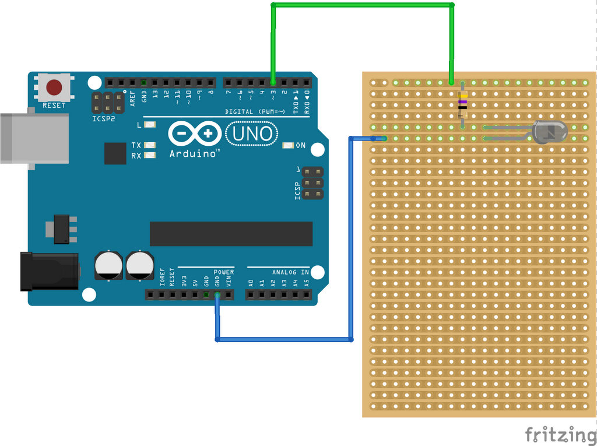
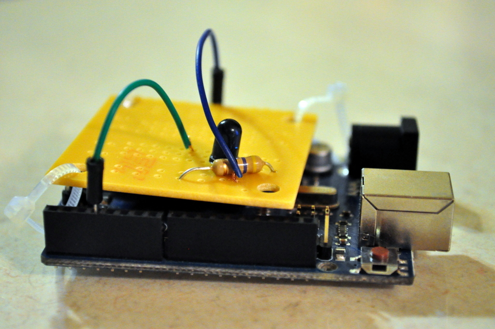
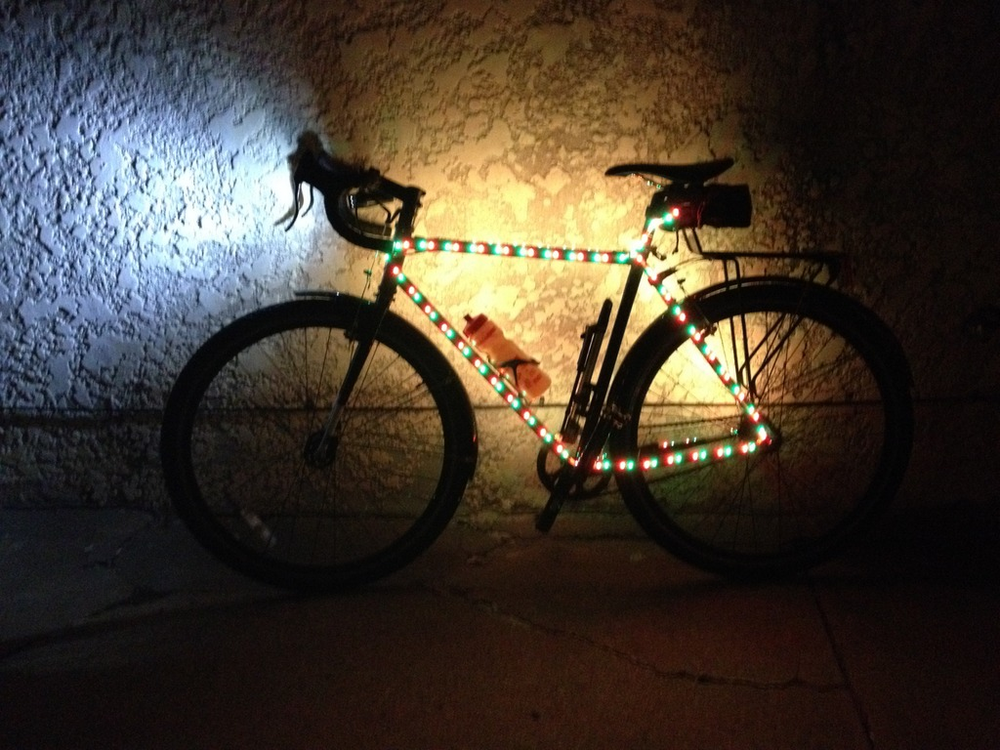

<blockquote class="instagram-media" data-instgrm-version="4" style=" background:#FFF; border:0; border-radius:3px; box-shadow:0 0 1px 0 rgba(0,0,0,0.5),0 1px 10px 0 rgba(0,0,0,0.15); margin: 1px; max-width:658px; padding:0; width:99.375%; width:-webkit-calc(100% - 2px); width:calc(100% - 2px);"><div style="padding:8px;"> <div style=" background:#F8F8F8; line-height:0; margin-top:40px; padding:50% 0; text-align:center; width:100%;"> <div style=" background:url(); display:block; height:44px; margin:0 auto -44px; position:relative; top:-22px; width:44px;"></div></div><p style=" color:#c9c8cd; font-family:Arial,sans-serif; font-size:14px; line-height:17px; margin-bottom:0; margin-top:8px; overflow:hidden; padding:8px 0 7px; text-align:center; text-overflow:ellipsis; white-space:nowrap;"><a href="https://instagram.com/p/wmZRuAH-cY/" style=" color:#c9c8cd; font-family:Arial,sans-serif; font-size:14px; font-style:normal; font-weight:normal; line-height:17px; text-decoration:none;" target="_top">A video posted by @mattdsteele</a> on <time style=" font-family:Arial,sans-serif; font-size:14px; line-height:17px;" datetime="2014-12-14T20:05:57+00:00">Dec 12, 2014 at 12:05pm PST</time></p></div></blockquote>
<script async defer src="//platform.instagram.com/en_US/embeds.js"></script>

I recently participated in the [Bike De'Lites](https://www.facebook.com/events/364954490330534/), a casual bike tour around Omaha's Christmas-decorated neighborhoods.

I like building [silly electronics](https://twitpic.com/28u48r) for rides like this, and was inspired by an LED light strip [Zach Leatherman](https://www.zachleat.com/web/bike-lights/) made recently.
Zach attached 5 meters of LED lights to his bike frame, but I wanted to take it a step further. Static lights are cool, but _I wanted to make them dance._

I wired the lights and attached them to my bike using the method Zach outlined, so it's worth [checking out his setup](https://www.zachleat.com/web/bike-lights/).

LED light strips are great: they're cheap (about \$10), super bright, and can be battery-powered. (There are "smart" strips that have individually addressible lights, but they're quite pricy.)

I picked up the [E-Goal 3528 RGB LED strip](https://www.amazon.com/gp/product/B00JX6SUWM/) off Amazon. It included a remote control to adjust the lights.



(The colors are a misnomer - the "purple" option simply turns the red and blue LEDs on at the same time.)

The remote control was nice, but I didn't want to be holding it and pushing buttons while riding. So I reverse-engineered the remote and made an automated one using an infrared LED and an Arduino.

## Seeing Infrared

Infrared remotes are finicky. They send pulses of IR light at specific frequencies (usually 38Khz, but not always) to a demodulator that understands only those codes. Each manufacturer has their own style, and many of the manufacturers attempt to make their signals more "robust" by sending the same command two or three times in succession. [Here's lots more on IR theory](http://www.sbprojects.com/knowledge/ir/index.php).

It doesn't take much to build a homemade IR blaster - first you need to decode the signal from the original remote, then replay it using an infrared LED (available at your local Radio Shack, if it hasn't shut down yet).



## Debugging the remote

I shouldn't have expected much from a \$10 gadget, so it's no surprise that the light strip and remote did not come with any instructions or data sheet.

After learning about infrared, I borrowed a [USB Infrared Toy](http://dangerousprototypes.com/docs/USB_Infrared_Toy), which provided a convenient way to both send and recieve IR signals. Surprisingly, it had the best support on [Windows](http://winlirc.sourceforge.net/), which I wasn't setup for.

I used [LIRC](https://www.lirc.org/), which looked like the best-supported Linux package to read and send IR commands. LIRC's remote database already had over 2000 devices available but the LED strips were not on there. Luckily the `irrecord` command lets you create your own device configurations, using a CLI-based wizard.

Aside: if you want to get the most features out of the IR Toy on Linux, don't use the LIRC version available out of the default repository - [get this package instead](https://launchpad.net/~forage/+archive/ubuntu/lirc). Otherwise it's stuck in the inferior "IRman" format.

Here's the configuration it generated:

```
begin remote

  name  remote.conf
  bits           16
  flags SPACE_ENC|CONST_LENGTH
  eps            30
  aeps          100

  header       8899  4526
  one           538  1688
  zero          538   558
  ptrail        554
  repeat       8901  2261
  pre_data_bits   16
  pre_data       0xF7
  gap          108279
  toggle_bit_mask 0x0

  begin codes
    on                       0xC03F
    off                      0x40BF
    dimmer                   0x807F
    brighter                 0x00FF
    flash                    0xD02F
    ...etc
  end codes
end remote
```

The header section defined the protocol for the code, and then it lists out the 16-bit hex values for each of the buttons. Pretty slick stuff!

## IRduino

Next was configuring the Arduino to send the IR codes. As a JavaScript guy, I had hoped to use Johnny-Five but had to discount it. First, this had to fit inside my saddle bag, and J5 requires the Arduino be tethered to a computer. Second, the Firmata protocol [doesn't support pulse-based units](https://github.com/rwaldron/johnny-five/issues/257). So I went back to Arduino's native C library.

The circuit was pretty straightforward, just a single infrared LED and a resistor:



I looked into sending the pulses using "pure" Arduino code, but found the [IRRemote](https://github.com/shirriff/Arduino-IRremote) library which abstracted lots of it for me.

IRRemote even included configurations for several popular code formats (Sony, NEC, RC5) but these didn't work for me. IRRemote's backup is the [`sendRaw`](https://github.com/shirriff/Arduino-IRremote/wiki/IRremote-library-API#irsendsendrawbuf-len-hertz) command, which lets you send a raw bit stream of data.

Another caveat: I had hoped to use an [Arduino Leonardo clone](https://flic.kr/p/q3kZfw), but the IRremote library [has a bug](https://github.com/shirriff/Arduino-IRremote/pull/42) with that model, so I switched to the Uno, which worked fine.



## Monday Night RAW

Unfortunately the configuration file LIRC generated didn't work with this (the hex values were too abstract), so I had to re-run the `irrecord` command using the `-f` flag to create raw codes. They looked like this:

```
begin raw_codes

  name on
    8874    4565     511     597     533     554
    533     575     511     575     554     554
    554     554     511     597     533     554
    554    1685     511    1685     533    1685
    575    1706     533     554     554    1706
    511    1685     533    1706     554    1685
    554    1685     511     575     554     533
    575     533     533     575     511     554
    554     533     533     575     554     554
    554    1685     533    1685     554    1685
    575    1685     533    1685     533    1685
    554

  name off
    //etc
```

Ugly, but it generated properly.

Then it was just a matter of converting these values to a C array and sending it IRRemote:

```c
IRsend irsend;

unsigned int on[67] = { 8874,4565,511,597,533,554,533,575,511,575,554,554,554,554,511,597,533,554,554,1685,511,1685,533,1685,575,1706,533,554,554,1706,511,1685,533,1706,554,1685,554,1685,511,575,554,533,575,533,533,575,511,554,554,533,533,575,554,554,554,1685,533,1685,554,1685,575,1685,533,1685,533,1685,554};

irsend.sendRaw(on, 67, 38); //command, array length, khz
```

After a bit of testing, it all worked! I whipped up a small program to go through a program of Christmas-y (red & green) light series, and sequenced through them after a random delay (from one to twenty seconds).



## Scope Creep

Like most projects, if I had more time I'd have made it more complicated. I was hoping to get the data from my bike's [cadence sensor](https://buy.garmin.com/en-US/US/shop-by-accessories/fitness-sensors/speed-cadence-bike-sensor/prod1266.html) over the ANT+ protocol. That way, each time I pedaled the lights could change colors.

Alternatively, I could attach a [tilt sensor](https://learn.adafruit.com/tilt-sensor/overview) to the bike and have the lights turn red while climbing uphill, and green while going downhill.

I also was a little disappointed with the IR signal - a handful of times the sensor wasn't aligned with the LED and would miss the signal.
My friend [Jonathan Rice](https://twitter.com/jricesterenator) suggested ditching the IR reciever and sending raw commands directly through the connectors.

All in all I'm pretty happy with this setup. It's way nicer than the battery-powered Christmas lights you'd pick up in a store. If you've got a night ride coming up, give it a shot!

## Resources

- All the code and configuration is available [in this Gist](https://gist.github.com/mattdsteele/c6c0504bdab640035f02)
- [Bookmarks tagged #lirc](https://delicious.com/mattsteele/lirc) on Delicious
- [More photos/videos of the lights](https://www.flickr.com/photos/orphum/sets/72157647434786353/) on Flickr
