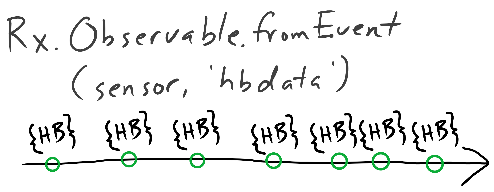

Recently I [hooked up a Raspberry Pi to my bike][bikepost] and made an LED light strip synchronize with my heart rate and pedal speed.
I got some great feedback on the project, including "overly complex", "Rube Goldberg wannabe", and "you need another hobby".

One challenge with this project was how to effectively manage sensor data from **multiple sources** (a heart rate monitor and a bicycle speed/cadence sensor) and have it control a single output (the LED strip).
Additionally, I needed to **manipulate the data** before I could send it to the LED light strip.
I also wanted to be able to **test my system with "fake" inputs**, so I wouldn't have to strap on my heart rate monitor every time I wanted to tweak the app.

It turns out that Reactive Programming techniques are perfect for a use case like this.

## Reactive Programming

If you're new to the concept of reactive programming, check out these guides:

- [RxMarbles](https://rxmarbles.com/) - you could just play around on this site and learn most of what you need
- [Introduction to Reactive Programming](https://web.archive.org/web/20160304013439/https://egghead.io/series/introduction-to-reactive-programming) course on egghead.io

## Creating the streams

Sensor input was grabbed from the [ant-plus](https://github.com/Loghorn/ant-plus) library.
It emits a [Node-style Event](https://nodejs.org/api/events.html) periodically (every 250ms for the heart rate monitor, and on every pedal stroke for the cadence sensor).

RxJS makes it easy to convert these to a stream:

```javascript
let Rx = require('rx');

//`sensor` emits 'cadenceData' events periodically
let rawCadence = Rx.Observable.fromEvent(sensor, 'cadenceData');
```

This produces an Observable stream of cadence events.
Each event in the stream gives me a full data object but I only need one element (the currently calculated cadence).
I also filter out some noisy events (initially you get some events without the calculated cadence set):

```javascript
let calculatedCadence = rawCadence
  .map(stream => stream.CalculatedCadence)
  .filter(cadence => !isNaN(cadence));

module.exports = calculatedCadence;
```

## Rendering the stream

The LED lights were represented by a class that stored the light's current state:

```javascript
class BikeLights {
  constructor() {
    this.intensity = 0; //controlled by heart rate data
    this.color = { r: 0, g: 0, b: 0 }; //controlled by cadence data
  }

  setIntensity(intensity) { //led light strip code }
  setRgb(percent) { //led light strip code }
}
```

And in the application:

```javascript
calculatedCadence
  .map(data => remap(data, 25, 100, 0, 1))
  .subscribe(data => lights.setRgb(data));
```

Here I'm using an [Arduino-style `remap`](https://web.archive.org/web/20160114022814/https://www.arduino.cc/en/Reference/Map) function to convert my cadence range (25rpm during easy pedaling, 100rpm during fast sprints) to a 0-1 range, which the lights class expects.
Then we pass that data to the LED lights.

## Faking out the stream

Creating a fake stream for testing was a piece of cake. In a separate file:

```javascript
//mock-cadence-stream.js

// Start emitting 30rpm, then switch to 90rpm after 5 seconds
let mockedCadenceStream = Rx.Observable.interval(1000)
  .timeInterval()
  .map(e => (e.value >= 5 ? 30 : 90));

module.exports = mockedCadenceStream;
```

In my production code, I simply commented out the stream I wanted to use:

```javascript
let cadenceStream = require('./mock-cadence-stream');
//Uncomment for real ANT+ data
//let cadenceStream = require('./cadence-stream');
```

Simple, but it gets the job done.

## A stream of hearts

Getting data from the heart rate monitor was similar but required a few additional RxJS tricks.
I used these Reactive functions:

- [`distinctUntilChanged`](https://rxmarbles.com/#distinctUntilChanged) to only emit when my HR changed
- [`debounce`](https://rxmarbles.com/#debounce) as 250ms was too rapid for my use
- [`flatMap` and `flatMapLatest`](https://reactivex.io/documentation/operators/flatmap.html) to convert the event data (beats per minute) into a stream of "heartbeat" events

You can see the full implementation on [GitHub](https://github.com/mattdsteele/raspberry-pi-bike-leds/blob/master/src/boot.js#L33-L35).

## I guess this was a weekend hack

This was my first experience using RxJS and Reactive Programming, and it shows.
I didn't write any automated tests to verify the behavior, but I think it would have been simple to do.
You can even mock out (and speed up) the passage of time using a [Virtual Time Scheduler](https://github.com/Reactive-Extensions/RxJS/blob/master/doc/api/schedulers/virtualtimescheduler.md).

I also coded up some pretty [terrible error handling code](https://github.com/mattdsteele/raspberry-pi-bike-leds/blob/master/src/boot.js#L70-L81) to switch the lights to 'idle' mode after 5 seconds without sensor data.
After thinking about it for a bit, I'm pretty sure I could have used a standard [debounce operator](https://reactivex.io/documentation/operators/debounce.html) rather than the recursive monstrosity I created.

But even as a non-expert in reactive paradigms I really liked using RxJS!
If you need to manage asynchronous events at a higher level than callbacks or `setTimeout` allow, give it a shot.

[bikepost]: /raspberry-pi-bike/
