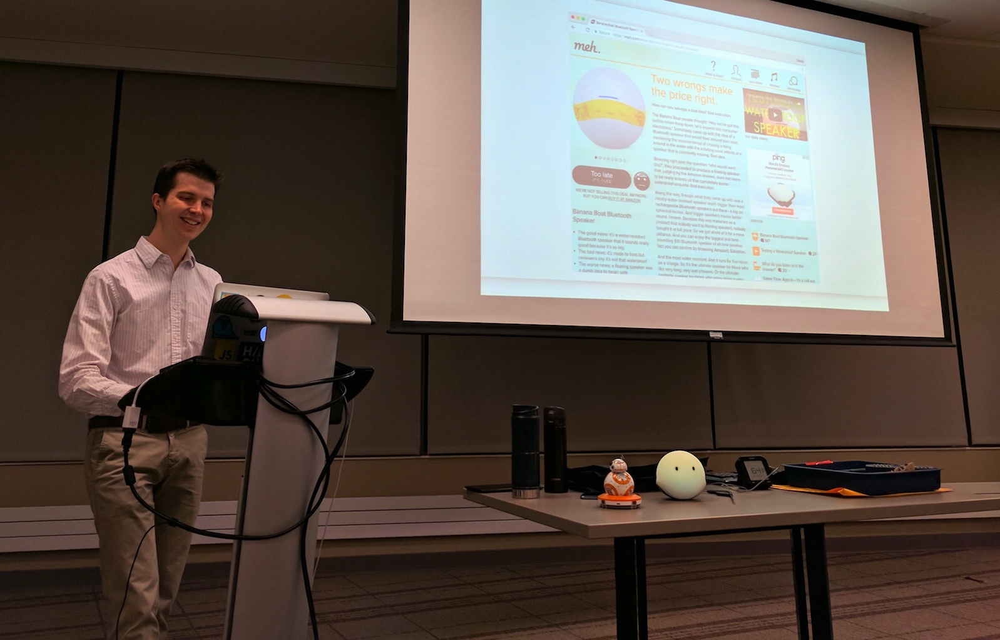

One of the side-effects to living that Internet-Of-Things lifestyle is that you end up with a lot of pseudo-smart devices, mostly collecting dust.
I wanted to see if Web Bluetooth could breathe new life into them.

Turns out, hacking Bluetooth Low Energy toys is _way_ more fun than actually using them.
[I spoke at NebraskaJS](nebraskajs.com) about what I learned, and why I'm excited about hooking Bluetooth up to the Web.

`youtube:https://www.youtube.com/embed/LPAKy9Rc4rA`

# Getting Started

Watch the talk, then check out these links:

- [Interact with Bluetooth Devices on the Web](https://developers.google.com/web/updates/2015/07/interact-with-ble-devices-on-the-web)
- [Bluetooth and Progressive Web Apps](https://medium.com/@urish/start-building-with-web-bluetooth-and-progressive-web-apps-6534835959a6#.2pqsde5i8)
- [Hacking Unicorns with Web Bluetooth](https://www.contextis.com/resources/blog/hacking-unicorns-web-bluetooth/)

# Devices

## BBQ Thermometer - [Code](https://github.com/mattdsteele/web-bluetooth/blob/master/src/bt/bbq.js)

I picked this one up from [Meh](https://meh.com/deals/grill-right-bluetooth-bbq-thermometer-1).
No specs available, but you can reverse engineer the temperature if you know some Big Endian notation.

For part of the talk I advanced my slides by dropping the thermometer into glasses of hot & cold water.
I called it TDD - _Thermometer-Driven-Development_.
Uncle Bob was right, TDD truly is the pinnacle of professional software development.

## Elfy Smart Light - [Code](https://github.com/mattdsteele/web-bluetooth/blob/master/src/bt/elfy.js)

The [Elfy](https://web.archive.org/web/20170224201620/http://en.emie.com:80/emie-elfy-smart-light) is a color-changing night light I picked up from a rando site in China. It looks the part.
You can hit it, and it'll alternate between a set of colors.

For one demo, I hooked up an `<input type="color">` to the Elfy.
I also wired it up to change color every time the BBQ Thermometer registered a new temperature.

[Jessica Codr](https://twitter.com/jcake09) and I also [built a timer](https://github.com/JCake/toasty-timer) for Toastmasters competitions.
This app is a great example of using Web Bluetooth for **progressive enhancement**.
For browsers that don't support Web Bluetooth, the app shows the color with a `
` on the screen.
If there's a Elfy nearby, you also get it on the device.

No specs on the Bluetooth services, so I had to reverse engineer it using Wireshark, as described in the video.

## Bicycle Speed/Cadence Sensor - [Code](https://github.com/mattdsteele/web-bluetooth/blob/master/src/bt/cycling.js)

I used a [Wahoo Bluetooth/ANT+](http://www.wahoofitness.com/devices/wahoo-blue-sc-speed-and-cadence-sensor) sensor. Luckily this used well-known Bluetooth GATT profiles, so hooking it up was a piece of cake; just required a little math.

I took some cues from [Max Goodman's Bicycle.js](https://github.com/chromakode/bicyclejs-talk) talk.
But his Progressive Web App was far too useful, so I just built a Flappy Bird clone. You know how we do.

## Sphero BB-8 - [Code](https://github.com/mattdsteele/bb8-simon/blob/master/src/sphero-bb8.js)

The [hottest Christmas toy of 2015](http://www.sphero.com/starwars/bb8) meets the technical stylings of 1985.
[Opera's devrel team](https://github.com/operasoftware/bb8) originally wrote the code to control the toy.
I removed the code that made it spin off my desk, and instead just had it change colors.
It's a testament to the remix culture of the web.
