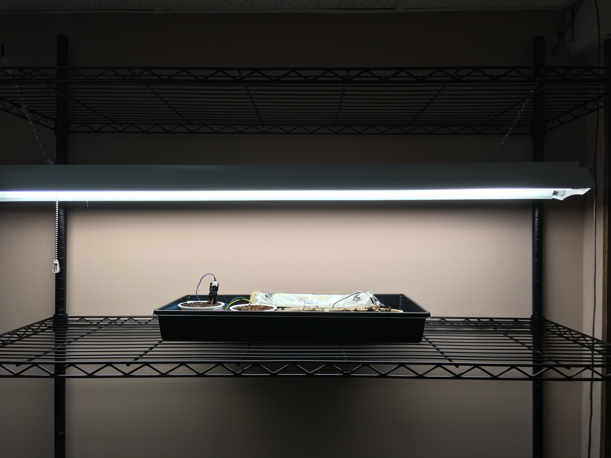
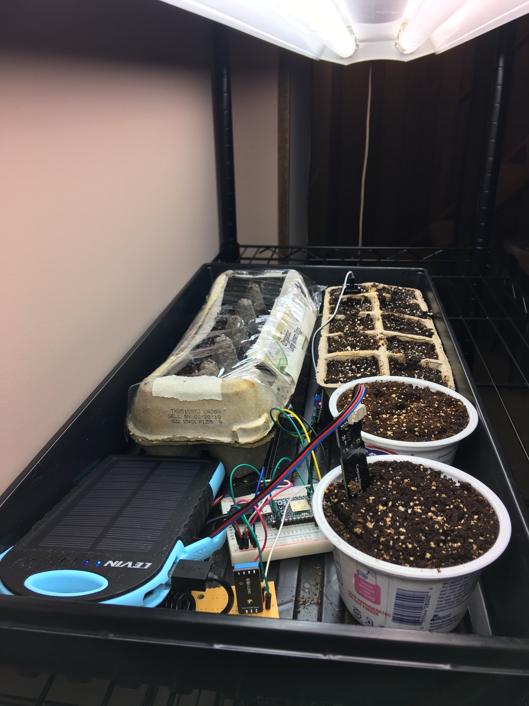
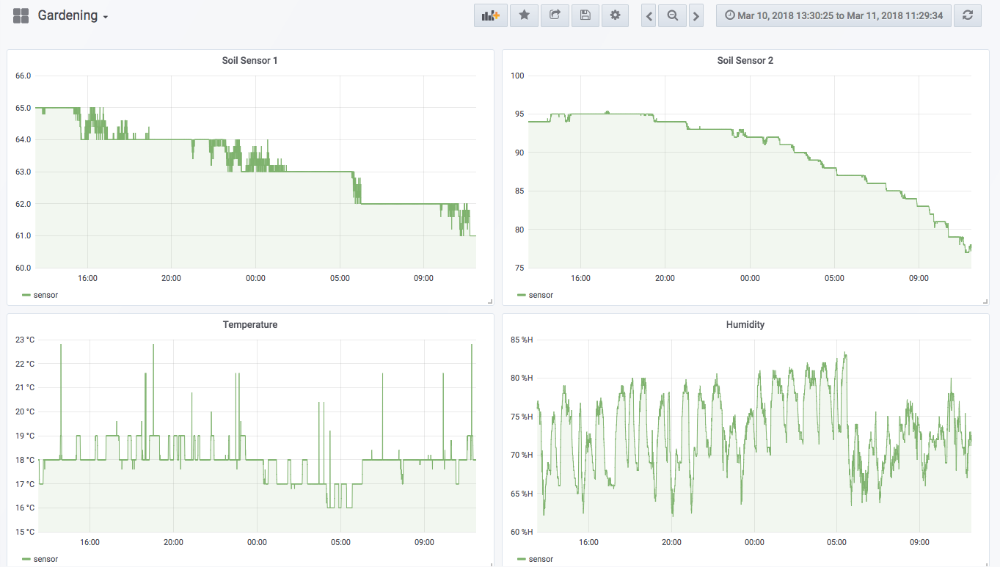
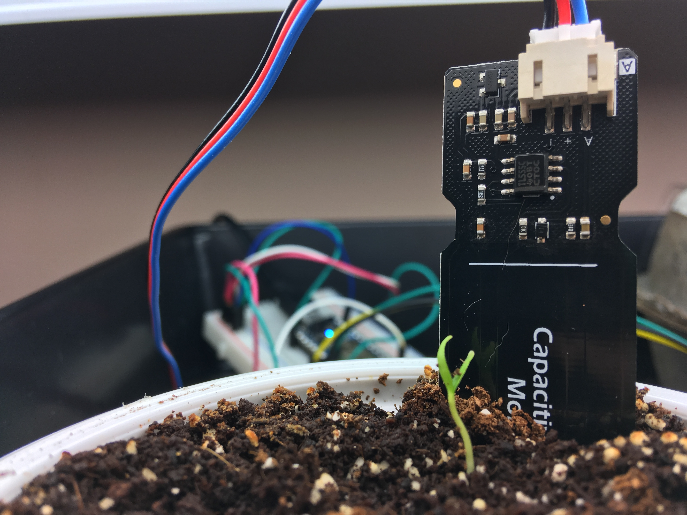

The last few years I've been trying my hand at starting a vegetable garden from seed. Previous years have left a lot to be desired; normally I end forgetting to water my anemic-looking seedlings, feeling sad, and harvesting a single ear of corn at the end of the season. 🌽

This year, I want to have some data when things go wrong. And I wanted to see what's new in [the new Geocities](https://steele.blue/hardware-is-the-new-geocities/). So, time to build some Arduino-based sensor systems in JavaScript!

## The Sensors

I wanted to keep track of the soil moisture as the seedlings were growing indoors. This can be done with a [Soil Moisture Sensor](http://a.co/ePXTcah), which just sends a reading to an analog GPIO pin.

I also picked up a few [DHT11 thermometer/humidity sensors](http://a.co/ePXTcah). These are a little tricker to use directly, but the [Adafruit DHT Library](https://github.com/adafruit/DHT-sensor-library) make it easy to collect readings.

## Raspberry Pi and Photon Farming



The microcontroller world has advanced quite a bit since I last checked! In 2014 I used the [Johnny-Five](http://johnny-five.io/) library to get sensor data into a Node app, but it required running Node on a "full" computer, then connecting to a USB-tethered Arduino. Tethering, _ugh_.

Nowadays, you can run Node directly on a Raspberry Pi, and connect to the Pi's GPIO pins using a [J5 plug-in](http://johnny-five.io/platform-support/#raspberry-pi-3-model-b). Sinc the Pi 3 has integrated Wi-Fi, the only cord you need is power.

Unfortunately, the Pi doesn't have analog GPIO inputs, which are needed for the soil moisture sensor. A few minicomputers such as the [Next Thing C.H.I.P.](http://johnny-five.io/platform-support/#chip) can do the job.

But in the end I was smitten with the [Particle Photon](https://docs.particle.io/guide/getting-started/intro/photon/), a Wi-Fi-enabled Arduino. It's super neat and crazy cheap. You connect it up to your wireless network, and emit events to the Particle cloud. They have a JavaScript SDK, which lets you receive these events in a Node app.

I can't tell you how satisfying it is to remotely flash new code to an Arduino while in another room, and have your app get new data 30 seconds later. You can install Arduino libraries, and it's low-powered enough that a 10k mAH USB battery runs the whole contraption for 3 days or so. Plus, it fits in a breadboard.

## At least I'm sprouting a dataset



To handle the sensor data, I pulled in RxJS, which [I've done before](https://steele.blue/reactive-programming-bike-sensors/) and find to be a super-solid approach. This let me take the Particle-provided EventEmitter, convert it to an reactive stream, and create a new stream out of the last 5 readings, averaged:

```typescript
import { getEventStream } from './photon-stream';

const event$ = getEventStream();

const stream = (eventName: string) => {
  return event$
    .filter(d => d.name === eventName)
    .map(d => {
      return { value: parseFloat(d.data) };
    })
    .bufferCount(5)
    .map(vals => {
      return vals.reduce((prev, curr) => prev + curr.value, 0) / vals.length;
    })
    .map(value => {
      return {
        value,
        time: new Date(),
      };
    });
};

export const soil$ = stream('soilMoisture');
```

This went straight into an InfluxDB instance, and mapped using Grafana. The whole thing is running in a few Docker containers on a DigitalOcean VPS, which was pretty nice to setup.

## Seems like a lot of work



It was a fun side project, but since I can now check on the sensor levels at all hours, I'm probably not reducing the number of mental cycles I'm thinking about the seedlings. And in the time it took me to build and test the hardware, I probably could have tilled my yard or done something more directly beneficial to my garden.

But I'm thinking it can pay off in the long-run. Once the seedlings get moved outside to the garden, I can transplant it outside, and control a [solenoid](https://www.sparkfun.com/products/10456) valve to automate watering throughout the growing season.

So yeah, JavaScript hardware is very possible, still cool, and has only gotten easier in the last 5 years. Go and build something cool with it!

You can view the code [here](https://github.com/mattdsteele/pi-garden), and see the charts [here](https://garden.steele.blue/d/Y5Y6Q2Rmk/gardening?orgId=1) (user/user).

Inspiration comes from John Hobbs's [homemade chicken incubator](https://incubator.velvetcache.org/).
