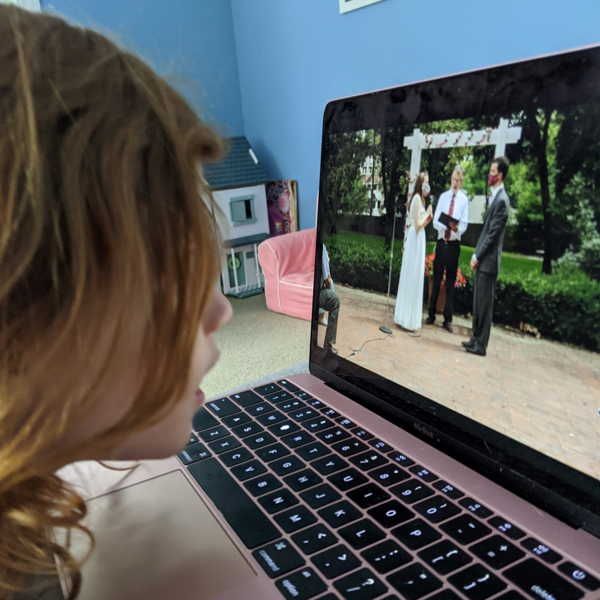

I got married! It looked a little different than we originally planned, due to it being, um, 2020.
Venue restrictions due to the global pandemic reduced the number of guests we could invite by 90%. And we had no desire to put our friends and family in harm's way.

But hey, it's 2020! With new tools like [Owncast][owncast], you can run a livestream for all the guests who can't make it to your event in person.
And you can do so without giving up control of your content, or acceding to the whims of companies who might not have your best interest at heart.

I'll writeup the technical recipe we used in a later post, but thought the desire to host a livestreaming server was worth writing about separately.

_Photo credit: Ben Turner_

## Twitch meets Indieweb

One of the lessons I've seen on the Web the past few years has been the cost to the increasing consolidation and siloing of your own content.
Writing on Medium instead of hosting your own blog, for example, means you're [subject to their nagware](https://indieweb.org/Medium#Issues), interstials to drive readers toward their native app, and other user-hostile actions. Your content is there for the purpose of increasing Medium's engagement and MAU numbers.

Streaming sites are just as subject to this nefarios behavior.
Twitch videos are routinely subject to [DMCA takedowns](https://twitter.com/TwitchSupport/status/1269851779790929921), YouTube prevents you from streaming [unless you have a requisite number of subscribers](https://support.google.com/youtube/answer/2853834?hl=en), and Facebook takes down DJ sets so routinely that [DJs are forced to mix faster to avoid detection algorithms](https://web.archive.org/web/20200921195316/https://www.papermag.com/instagram-live-copyright-dj-censoring-2645789312.html?rebelltitem=16)

And content disappears. When Twitch's predecessor justin.tv pivoted to gaming, its [millions of videos](https://arstechnica.com/gaming/2014/08/streaming-video-site-justin-tv-announces-closure-effective-immediately/) were all taken offline. [Mixer just shut down last month](https://mixer.com/). More sites to add to the [internet's cemetary](https://indieweb.org/site-deaths).

This was a real concern for our wedding: we were going to have copyrighted music before the ceremony, and didn't want to just hope the [takedown bots wouldn't find us](https://www.washingtonpost.com/entertainment/music/copyright-bots-and-classical-musicians-are-fighting-online-the-bots-are-winning/2020/05/20/a11e349c-98ae-11ea-89fd-28fb313d1886_story.html).

But through cheap cloud VPS hosting and open-source tooling, we now have the tools to take back control of our streaming world.

## Streaming with Owncast

The [Owncast][owncast] project couldn't have arrived at a better time.
Billed as "Twitch in a box", it lets you start up a server to publish an RTMP video stream, transcode it to various qualities, and host an HLS-compatible livestream that will automatically choose the proper bitrate for the user's bandwidth.
It also provides a website to view the stream alongside a chat feed.
Plus it's [written in Go](https://github.com/gabek/owncast), so it was easy to start contributing new features and bugfixes.

Combined with tools like [OBS](https://obsproject.com/) to publish a stream, you can easily start broadcasting with a \$5 VPS from the cloud provider of your choice.

And since you own the server, you can customize it to your liking.
We just wanted the video and weren't interested in chat, so we embedded the stream directly on the wedding website.
We also were able to use the Owncast status API to detect when the stream was live, and disabled the embed while the stream wasn't running.

## Publish Once, Syndicate Everywhere

Some of our wedding guests asked for a Zoom link, so we set up a simulcast to broadcast to a Zoom room, alongside our wedding website.
This was a convenient way to meet folks where they already were.

In total we had 47 folks streaming via the Owncast server, and another 50 or so on the Zoom call.
It's a nice way to garner the benefits of the [POSSE][posse] philosophy, and be pragmatic about garnering the reach social networks afford without relinquishing control of your content.

[owncast]: https://gabekangas.com/blog/2020/06/owncast-a-project-to-take-control-over-your-own-live-streaming/
[posse]: https://indieweb.org/POSSE
