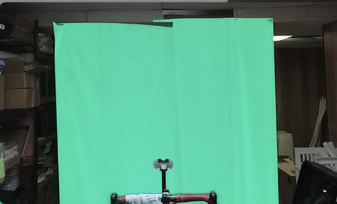
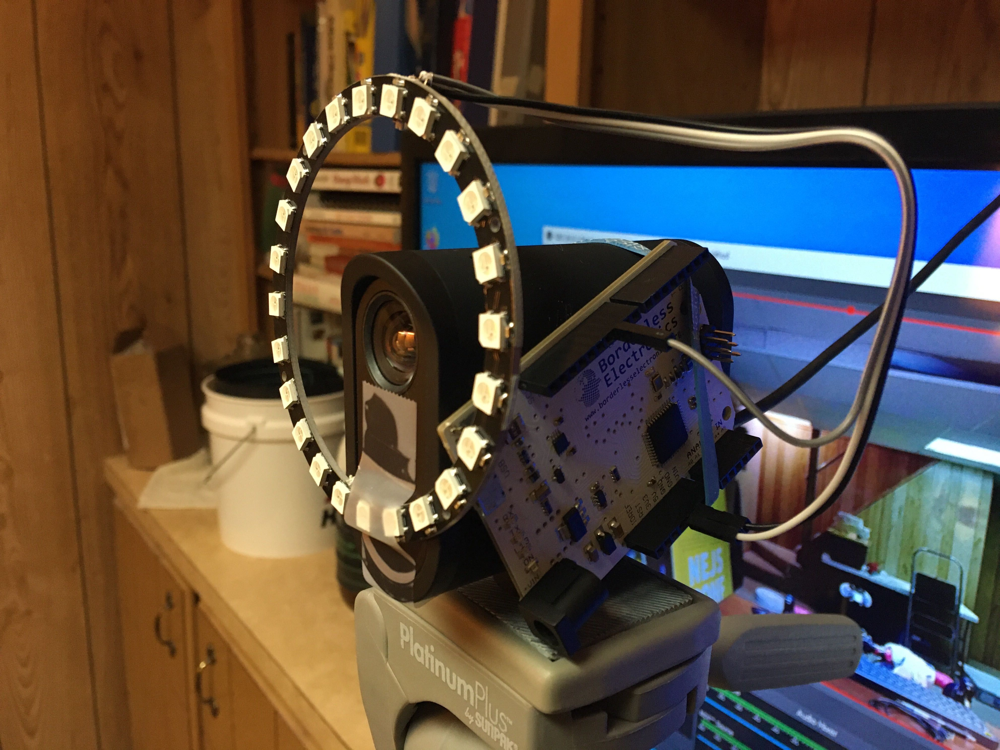
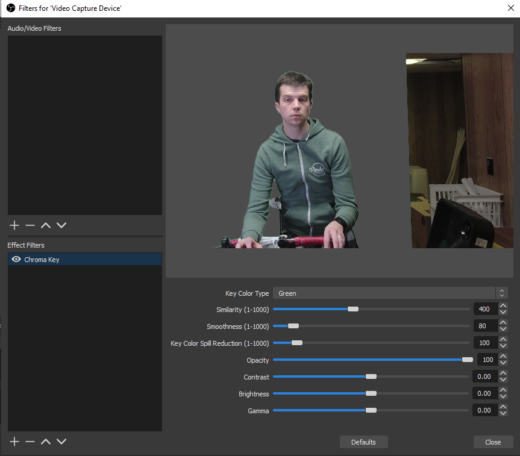

As group bike rides are doubly out this pandemic-laden winter, I've been doing more bike racing on Zwift, and playing with livestreaming races.

Zwift streams in-world aren't especially exciting. It's way more fun when you can watch a video of the person riding and suffering along.
And if you're going to be suffering, you want to increase the production value.

`youtube:https://www.youtube.com/embed/iqXJv3f0VhE`

I've been having a great time adding chroma key (green screen) to my video. Traditionally this has been a pain, requiring significant investments in lighting and screen positioning to do well.
But with some LEDs and retroreflective fabric, you can make a well-functioning green screen on the cheap.

Most green screens use, well, green fabric. But this approach uses a different strategy: putting a ring of green LEDs around a camera and pointing it at [retroreflective fabric][fabric], so the green light shines directly back at the source.



For the most part, I followed [this guide on Brainy Bits](https://www.brainy-bits.com/post/making-a-green-screen-that-doesn-t-require-any-lighting).

I was able to build this all out for about $40, which is a steal compared to other green screens.

## Materials Needed

I presume you have a webcam already.

* Retroreflective fabric: I picked up four yards from an [eBay seller in Canada](https://www.ebay.com/itm/SILVER-REFLECTIVE-FABRIC-sew-on-material-width-39-inch-1-meter/111778351514?ssPageName=STRK%3AMEBIDX%3AIT&var=410769250135&_trksid=p2057872.m2749.l2649).
* Some way to hang your fabric: I used some magnets, but you could sew it around a PVC frame, or just tape it to a wall
* LED Ring: [16 LED NeoPixel clone from AliExpress](https://www.aliexpress.com/item/1005001579299841.html?spm=a2g0s.9042311.0.0.189d4c4dksRwrm) works well
* Something to drive the LEDs: I used an Arduino I had lying around, but anything that can drive a NeoPixel works, such as [this IR remote](https://www.amazon.com/gp/product/B075SXMD9Z/ref=ppx_yo_dt_b_asin_title_o00_s01?ie=UTF8&psc=1)

## Building it



If you're using an Arduino to drive the LEDs, you should be able to hook up 5V, ground, and a data pin to the LED rings. A simple app using [Adafruit's library](https://github.com/adafruit/Adafruit_NeoPixel):

```cpp
#include <Adafruit_NeoPixel.h>

#define PIN        6 // On Trinket or Gemma, suggest changing this to 1
#define NUMPIXELS 16 // Popular NeoPixel ring size

Adafruit_NeoPixel pixels(NUMPIXELS, PIN, NEO_GRB + NEO_KHZ800);

void setup() {
  pixels.begin(); // INITIALIZE NeoPixel strip object (REQUIRED)
}

void loop() {
  pixels.clear(); // Set all pixel colors to 'off'
  for(int i=0; i<NUMPIXELS; i++) { // For each pixel...
    pixels.setPixelColor(i, pixels.Color(0, 30, 0));
    pixels.show();   // Send the updated pixel colors to the hardware.
  }
}
```


Place the ring around your webcam; I used some Velcro stickers so I can easily remove it.


Hang up the fabric; it should be far enough away from your bike that it won't get in the way while you're riding, but close enough that you don't need to buy a ton of it.
I ended up cutting the fabric to make two 3'x6' banners, and hanging on the ceiling with neodymium magnets.


## Chroma Key in OBS

Power the LEDs to a pure green. You can probaby run it at a low power; if you go too high you'll get some green on you, which isn't ideal. I have mine at 25% of max.

This can be set in OBS as a Filter on your webcam Source. You can play with the properties, but I was able to get by with the default values.



Then setup your stream layout. A decent placement is in the bottom left of the screen, Zwift doesn't put anything useful in there.

Happy Zwifting! Your FTP won't be any higher, but at least you'll look a little more stylish riding in Watopia.

[fabric]:https://en.wikipedia.org/wiki/Retroreflector#Other_uses