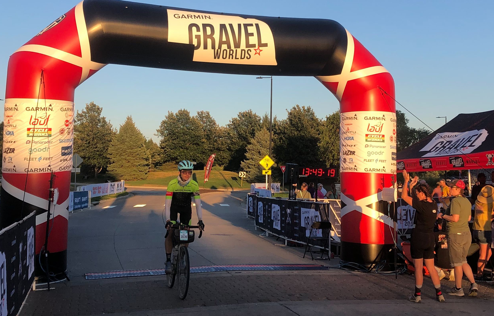
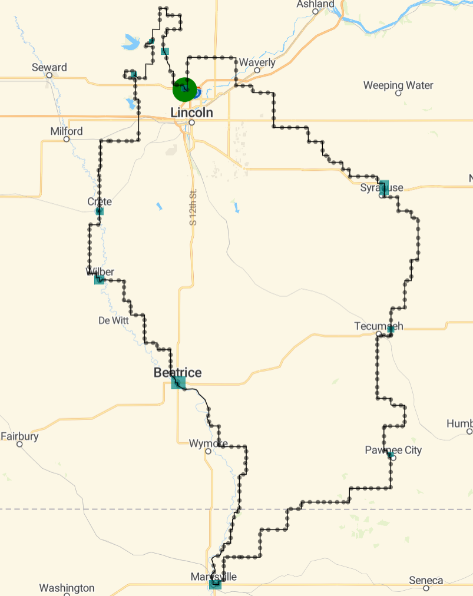
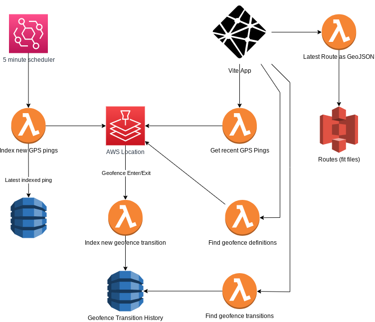

I recently participated in the Gravel Worlds [Long Voyage](https://www.gravel-worlds.com/the-long-voyage) bike race. Last year I [tried, and failed](/gravel-worlds), to finish the 300 mile course, and [built a pacing calculator along the way](/js-temporal).

This year, I felt better prepared, rode smarter, and actually finished! My intent was to simply complete the race within the time limit, with a stretch goal of finishing before sundown. I ended up making it with about an hour of sunlight to go, and I couldn't be happier.



I credit some of my success this year to spending more time riding through the year, both on longer gravel base rides, and structured intervals on the trainer. But I still had enough time to build another dubiously useful website!

That's what I want to share today; a site that captures data from a GPS tracker, and makes it available for folks to track my progress. There are a number of public versions of this (they call it [dot watching](https://www.cyclist.co.uk/in-depth/10221/what-is-dotwatching)), but I wanted to add some fancier features, such as making geofences at expected stops, and capturing enter/exit times.

I built out the site using AWS serverless architecture (Location Services, Lambda, and others).
The code is available at https://github.com/mattdsteele/spot-tracker-tracker, and you can see the page for my ride [here](https://track.steele.blue/?course=gw-2022).



## Capturing GPS Pings

I used a [SPOT Messenger][spot] device; which all racers were required to carry with them. 
SPOT devices are neat; they were designed with fairly easy-to-use APIs, along with a set of prebuilt maps you can share with friends.

To get geofencing and other features, I had to ingress each GPS ping into the AWS Location data store. This required the use of a Lambda function, scheduled to run at the same frequency that GPS pings were emitted (5 minutes).

This (as well as all the other Lambdas in the project) were built as Go functions.

Calls to SPOT's history API returned all observations over the past 24 hours, so I needed to find a way to only send in calls that hadn't been indexed before. I ended up keeping track of the latest timestamp via an object in DynamoDB, and only returning newer data. [There might be more efficient ways to do this](https://www.reddit.com/r/aws/comments/o9kntm/converting_a_location_history_rest_api_into_aws/).

Once the pings were stored as an asset in AWS Location, they remain for 30 days.

## Geofencing


AWS Location also supports [geofences](https://docs.aws.amazon.com/location/latest/developerguide/geofence-tracker-concepts.html). For each GPS ping that arrives, it can be evaluated against a set of predefined geofences. These are emitted via EventBridge, and you can react to them with Lambda functions as well.

I stored entrance/exit events for each geofence in another Dynamo table.

## Routes

Cycling routes are traditionally saved as `.fit` files, among other formats. These files aren't usable in mapping libraries directly; they have to be converted to GeoJSON or another similar technology.

To do this, I used Tormod Erevik Lea's [fit Go library](https://github.com/tormoder/fit), which made easy work processing the .fit files.

I wanted to make this easy to use, so I made an S3 bucket so I could upload `.fit` files as I set courses up. I then built a Lambda that found the latest file in the bucket, and returned the coordinates in an easy to process JSON format for the UI.

```go
lambda.Start(func(ctx context.Context) (events.LambdaFunctionURLResponse, error) {
    config, _ := config.LoadDefaultConfig(ctx)
    files := spot.GetFilesInBucket(config)
    latestFile := files[0]
    fileContents := spot.DownloadFile(*latestFile.Key, config)
    fitFile := spot.ParseFitData(bytes.NewReader(fileContents))
    course := toCourse(fitFile)
    j, err := json.Marshal(course)
})
```

## REST Services

AWS Location has a set of REST services and JavaScript APIs, but I found them to either be very heavyweight (using AmplifyJS), or required setting up a multitude of additional security and IAM authorization policies, which I wasn't confident I could implement properly. All I wanted to do was provide some read-only data to a website!

I ended up exposing the Lambda functions as REST endpoints. This is a [new-to-me feature](https://serverlessland.com/patterns/cloudfront-lambda-urls), which makes it dead-simple to provide read-only access to Geolocation data, or any other AWS resource.
The URLs aren't pretty, and by default are on another origin, such as https://6f7w2jqblnebkk75folo4zv7j40qvxfp.lambda-url.us-east-2.on.aws/. I'd love to host these under the same domain as my UI to avoid cross-origin requests, but [it appears to be quite complicated](https://github.com/simonw/public-notes/issues/1), so I'll live with CORS.

## Website

The app itself is pretty barebones; it loads a full-screen MapLibreGL map, and adds the appropriate layers for routes, geofences, and GPS pings.
There's a few geospatial functions to calculate how far on the course you've gone [using the nearestPointOnLine function](https://www.reddit.com/r/gis/comments/tvrtzw/bike_mapping_given_a_gpxtcx_route_can_i_map_match/), but there's nothing too fancy there.

I built the app using [Vite](https://vitejs.dev/) as my build tool and scaffolding (using their vanilla-ts template). I've been very impressed by the modern, ESM-first tools, which don't bundle anything in development, leading to a fast feedback loop.
I still was able to use TypeScript and other modern affordances, and could pull in modules like date-fns as needed, without feeling overwhelmed by tooling. It's not quite [toolchainless](/toolchainless), but it's close!

The UI it built via GitHub Actions on each push, and deployed to Netlify. I also have branch deploys configured, which allows me to save off the service calls as JSON files for posterity.

## Cost



Since none of the resources I'm using are persistent, the app is stupid cheap to run. My current AWS bill is about 77 cents per month. Location Services cost 15 cents, S3 storage is another 7 pennies. I'm no longer on the AWS free tier, but at these prices I might as well be.

I came into this project believing that serverless architectures are great for small hobby projects like this, and I remain more convinced this is the case. Since everything scales to zero, I can leave everything running and ready for next year.

## Next Steps

There's plenty of room for improvement here. I'd love to make it easy for someone else to deploy, via a Terraform or other infrastructure-as-code options. Tools like https://github.com/GoogleCloudPlatform/terraformer may make this easy.

I'd also like to find ways to send push notifications to interested parties when I enter/exit geofences. This feels like it should be possible using [Web Push](https://developer.mozilla.org/en-US/docs/Web/API/Push_API), even if it's fallen out of favor as an API over time.

Overall I'm pretty happy with this project. I'm planning on trying the Long Voyage course again next year, so I'll have plenty of opportunities to procrastinate training by hacking on this further!

[spot]: https://en.wikipedia.org/wiki/SPOT_Satellite_Messenger
