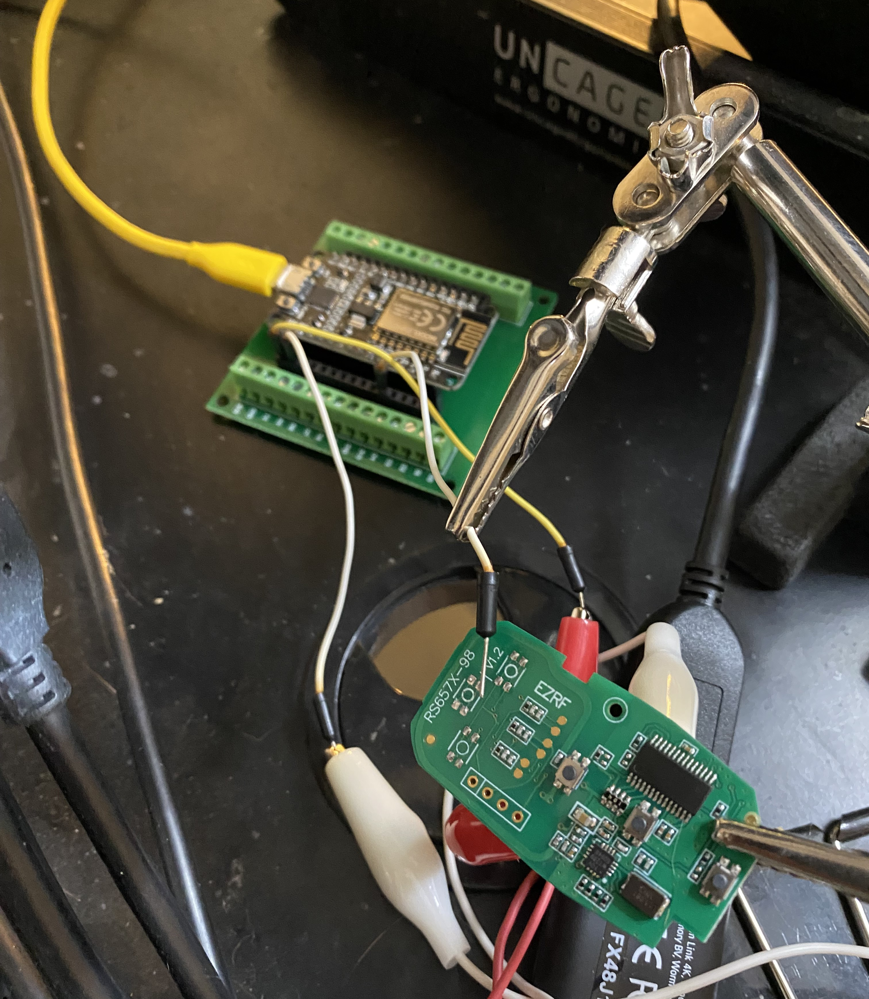
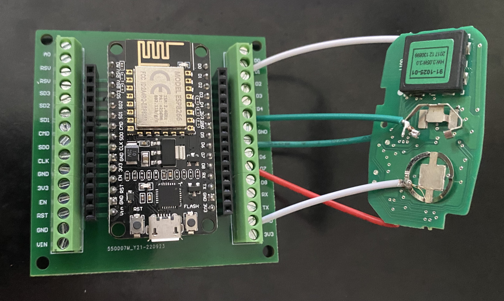
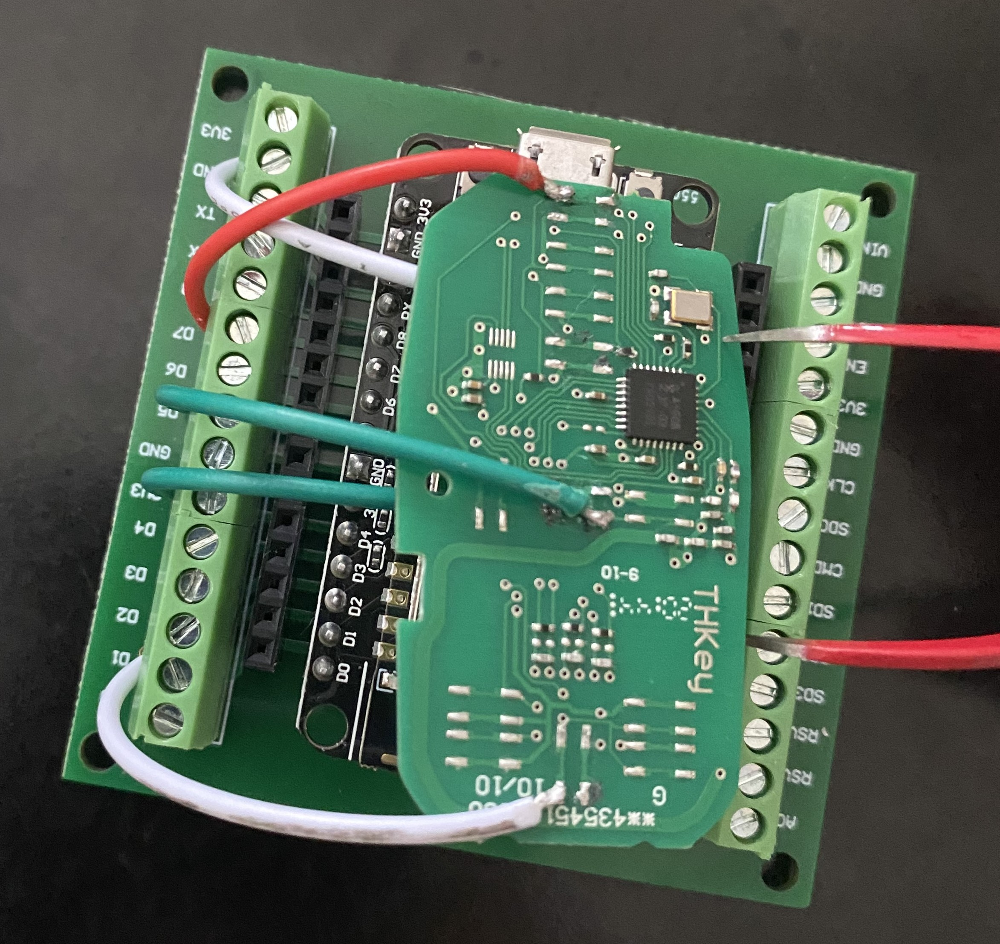

<video controls preload="none" muted="true" poster="/images/car-lock-snap.png">
  <source src='/videos/car-lock-demo.mp4' type="video/mp4" />
</video>

I recently bought a new vehicle (the now-discontinued Chevy Bolt), it's great! Coming from a 14 year old car, everything about it feels space-age.

This is the first vehicle I've owned that has a remote start button on the keyfob, which I'm fascinated by.  It also integrated with a mobile app, which enabled locking & remote start from a phone, but requires a monthly subscription.

I wanted to see if I could build something similar with "standard" IoT and home automation tools. It would only work when the car is at home, but it would accomplish my goal of letting me remote start my car on a cold day without having to find my keys.

I had a few goals:

* Don't do anything warranty-voiding. That means no messing with the car's wiring or internal computer
* Everything runs on-prem - because [the "S" in IoT stands for Security](https://www.iot-inc.com/the-s-in-iot-stands-for-security-article/)
* Integrate into an existing Home Assistant setup, so I can tie into rest of the home automation ecosystem I've been building up

A few others have gone down this route, by wiring up a spare fob to a microcontroller (Arduino, Raspberry Pi, etc), and "pressing" the unlock/lock/start buttons electronically. Seems feasible!

* https://hackaday.com/2021/01/06/automating-your-car-with-a-spare-fob-and-an-esp8266/
* https://www.hackster.io/user03583/ok-google-start-my-car-7088dd
* https://gitlab.com/milagrofrost/esp8266-car-key-fob-iot/
* https://github.com/Radacon/ESP_Remote_Start


## Hardware



**Spare Car Fob** - I picked up a cheap aftermarket fob on AliExpress, though it took a bit of time confirming compatibility.
I ordered this one for the 2023 Bolt: https://www.aliexpress.us/item/3256804168747183.html

The Bolt lets you program additional fobs at home, without needing a dealer or locksmith. The metal "blade" isn't cut, but I'm never using it for "actual" car operations, so I'm not too worried.

**ESP8266** - Any microcontroller that can output 3.3V should work, and I'd been wanting to experiment with ESP devices for a while. I used this: https://www.amazon.com/dp/B07HF44GBT

I wired everything up using a [breakout board](https://www.amazon.com/dp/B08D3FF6WY), since the circuits went straight from GPIO pins to the fob buttons.

Some other projects I saw added diodes in the circuitry to prevent flyback voltage to the buttons, but I didn't find it was necessary. Let's see if future me regrets this!

## Wiring Up the Fob

This took a bit of experimenting. Using a multimeter, I found the buttons were letting 3.3V run through, which went down to 0V when it was pressed down.

The buttons are surface mounted on the fob's PCB. Removing them would be pretty easy with the right tools, such as a heat gun. I did not have said tools, so I just cranked up my soldering iron and jabbed at it until the buttons disintegrated. Hopefully you're better at this.

Once I exposed the bare pads on the fob, there was a bit of trial and error to find which lead was connected to the fob, and which to ground (I used a breadboard and just tapped the pads while seeing if the car responded). From there, I soldered a wire between the connected pad, and onto a GPIO pin on the ESP8266, [via this pinout](https://randomnerdtutorials.com/esp8266-pinout-reference-gpios/).

## Software



**Home Assistant** - I already had an instance running on a Raspberry Pi, so this was easy.

**ESPHome** - This is a [really neat project](https://esphome.io/) that exposes an ESP8266 (or ESP32) as a device in Home Assistant. You upload their firmware on your ESP, and it'll securely integrate with your HA environment. You can then configure its operation via simple YAML, so you don't have to maintain any code or event loop.

Here's the "Unlock" section of my configuration:

```yaml
output:
  - platform: gpio
    pin:
      number: GPIO5
      inverted: true
    id: UnlockButton

button:
  - platform: output
    name: "Unlock"
    output: UnlockButton
    duration: 400ms
```

Note the `inverted: true` - I found that fob buttons are "normally open", so a button press brings it back down to 0V.

Another thing I really liked about ESPHome: they have a [web-based flashing tool]( https://esphome.github.io/esp-web-tools/) to upload the custom firmware onto your ESP8266.
Once flashed, everything else is done wirelessly via the onboard Wi-Fi chip.
This is _way_ more convenient than the Arduino or MicroPython workflows I'd experimented with; which required driver installation and a terminal emulator.

Once you've setup the appropriate buttons in the ESPHome configuration section (I found 400ms worked for lock/unlock, and 3000ms was needed for remote start), install to the ESP via an OTA update, and Home Assistant should recognize the new devices.

I then created a Dashboard in Home Assistant so I had easy access to the buttons.

## A few things I learned



* While testing the fob buttons, I discovered the “start vehicle” and “trigger alarm” buttons were reversed from how they were labeled. As did all my neighbors!
* Soldering on a surface-mount board is hard! I ended up bricking my first fob because I got a little solder on some adjoining transistors, which short-circuited the entire device and rendered it useless. I suppose this gets better with practice, but when you treat hardware projects [with the same rigor as a Geocities website](/hardware-is-the-new-geocities/), it's not something you improve at quickly.
* The ESP8266 is a really cool device; and it's fascinating to have something so easily programmable be at a price point where I can just treat the microcontroller as a dedicated component to this project.  With a Raspberry Pi or Arduino I'd be sure to salvage after I was done with the project, but at less than 5 bucks, I don't feel bad soldering directly onto it.
* There's a few home automation/IoT aspects I haven't gotten to yet; designing and 3D printing a custom enclosure would be a nice way to finish the project. For now, it's just sitting on a shelf.

## What is it good for, absolutely nothing

This setup has a few limitations. In particular, it only works when I'm on-network in my house, and the car is in physical proximity to the fob, but I consider that a feature rather than a bug. Adding some physical safeguards helps me sleep a bit better.

I still don't really know what I'm going to do with the project. Since it's tied into home automation, I could easily setup a few interesting workflows:

* Automatically lock the vehicle at 10pm
* If the temperature drops below freezing and it's a workday, start the car 10 minutes before my commute

I'm fully ready to admit these might be solutions in search of a problem, but I still had a fun time working on this. And maybe, the real vehicle automation is the friends we made along the way.
